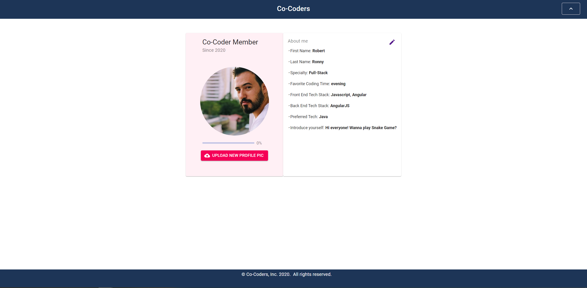

# v21-geckos-team-02

# CO-CODERS PROJECT

## **Overview**

This app serves as a tool for developers to connect to other people with similar skills, tech-stacks, and interests. Individuals create a profile and then can view other people's profiles.
**LIVE LINK**:[here]()

## Features

- Sign Up
- Sign In
- Sign Out
- Password Forget
- Password Change
- Proctected Routes with Authorization
- Uploads and updates Profile Picture
- Creates a Profile including image, username, location, tech stack, available hours and introduction.
- Edit and Updates Profile
- Views other profiles From the dashboard

## Setup

### Firebase

This application makes use of Firebase for authorization and Firestore for database and Storage for images

Before deploying, you will need to set the config variables in `/src/components/Firebase/Firebase.js`.

## Screenshots

## Dependencies

- firebase
- material-ui
- react-hook-form

### **Running The Project**

#### Installing the code

1. Ensure you have node version 10.16.0 or higher before proceeding.
2. Download or clone the code from this repository
3. Change to the root directory and run the script `npm install` to install the depedencies.
4. Visit http://localhost:3000 in the browser.
5. Use your own Firebase Credentials.

### Use your own Firebase Credentials

1. Visit https://firebase.google.com/ and create a Firebase App.
2. Copy and paste your Credentials from your Firebase App into src/Firebase/firebase.js.
3. Activate Email/Password Sign-In Method in your Firebase App.
